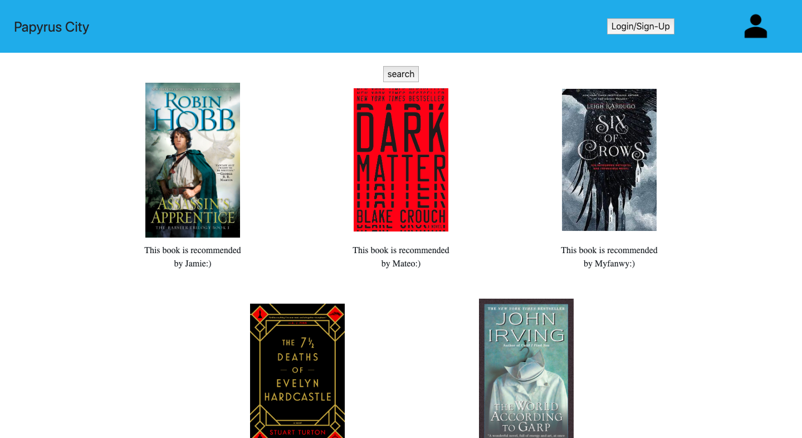
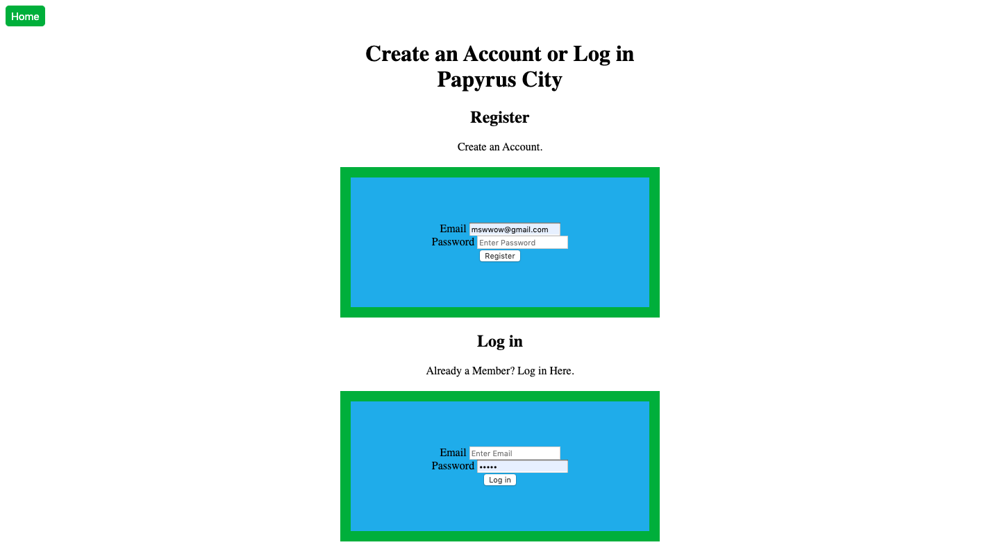
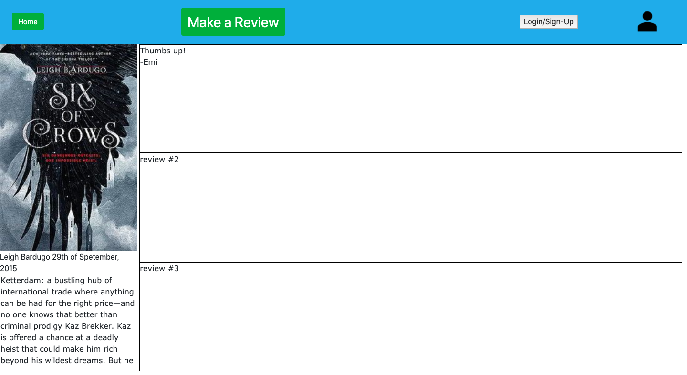
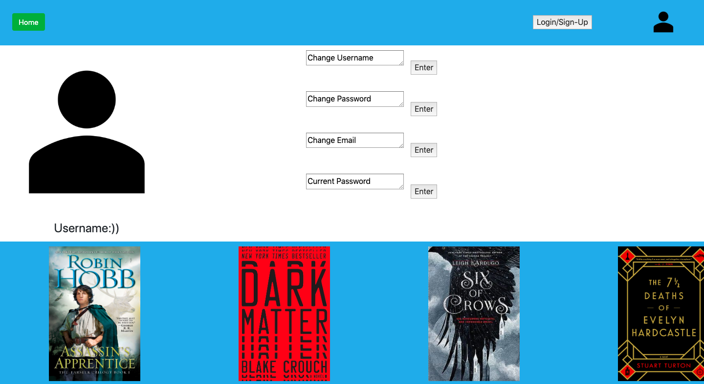

# Hightechu Academy Group Project :metal:

HighTechU Group Project

## Papyrus City

### Website :star:

[Live Demo](https://papyrus-city.herokuapp.com/index.html)

### Mini Pitch :ghost:

A website for teens to find books they enjoy and to discuss and recommend books to friends, online or otherwise.

### Problem Statment :mega:

Most book websites have a majority of adult or kid readers, even on books aimed at teens. This website aims to focus on ages 13-20, which are disproportionately under-represented on many other sites.

### User Stories :snowboarder:

* I want my users to be able to sign up and log in.
* I want my users to be able to search for books.
* I want my users to be able to read books online.
* I want my users to be able to review books.
* I want my users to be able to read reviews from others.

### Website Pages :speedboat:

* Home Page -> `index.html`
* Login / Register Page -> `login-register.html`
* Book Page -> `book-page.html`
* Make a Review Page -> `makeareview`
* Search Page -> `search.html`
* Results Page -> `results.html`
* Personal User Page -> `user-page.html`

### Promo :grinning:






## Getting Started :thinking:

### Requirements :dog:

* [git](https://git-scm.com)
* [Node.js](https://nodejs.org/en/)
* [npm](https://www.npmjs.com) (**Installed with Node.js**)
* [LoopBack CLI Tool](https://loopback.io/lb3/getting-started)

### Obtaining the Project :cat:

1. Open the terminal

2. Change into your working directory

```
cd working/directory
```

3. Clone the repository 

```
git clone URL
```

4. Change into the repository

```
cd REPO_NAME
```

### Running the Application :deer:

1. Install the node_modules

```
npm install
```

2. Run the application locally

```
node .
```

3. Head over to [http://0.0.0.0:3000](http://0.0.0.0:3000) and [http://0.0.0.0:3000/explorer](http://0.0.0.0:3000/explorer) in the browser of your choice.

### Adding Custom Models :ocean:

1. Add Custom Models

```
lb model
```

2. Follow command prompts

## Deploying :bear:

We are using Heroku to host our application. The following steps should only be done once. After setting up the application to deploy with GitHub, everytime you push to the master branch you will re-deploy your application.

1. Log into [Heroku](https://id.heroku.com/login)

1. Create a new app

1. Setup `Deploy with GitHub` (Deploy -> GitHub -> Select Repository)

1. Setup a `mongodb datasource for loopback` using [mLab MongoDB addon](https://elements.heroku.com/addons/mongolab)

1. Replace the `server/datasources.json` with the following:

```json
{
  "db": {
    "db": {
      "url": "mongodb://URL",
      "name": "mongoDS",
      "useNewUrlParser": true,
      "connector": "mongodb"
    }
  }
}
```

**Make sure to replace `URL` with the URL the Heroku mLab MongoDB addon provides.**

## Resources :blue_book:

* [GitHub](https://github.com)
* [GitHub Help](https://help.github.com/)
* [GitHub Markdown Help](https://help.github.com/en/articles/basic-writing-and-formatting-syntax)
* [GIT Command Line Cheat Sheet](https://education.github.com/git-cheat-sheet-education.pdf)
* [Heroku](https://www.heroku.com)
* [Heroku Documentation](https://devcenter.heroku.com/categories/reference)
* [Loopback](http://loopback.io)
* [Loopback Documentation](https://loopback.io/lb3/getting-started)

## Support :grey_question:

For support, visit the [HighTechU Academy Slack]().
